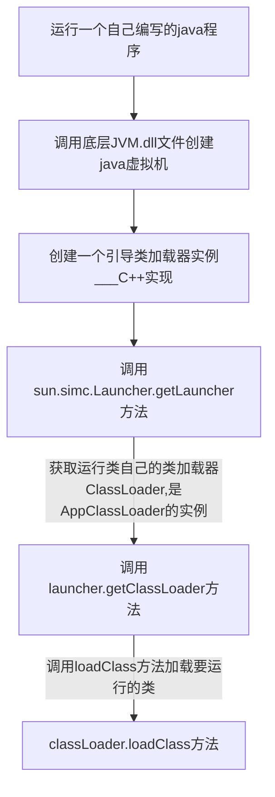
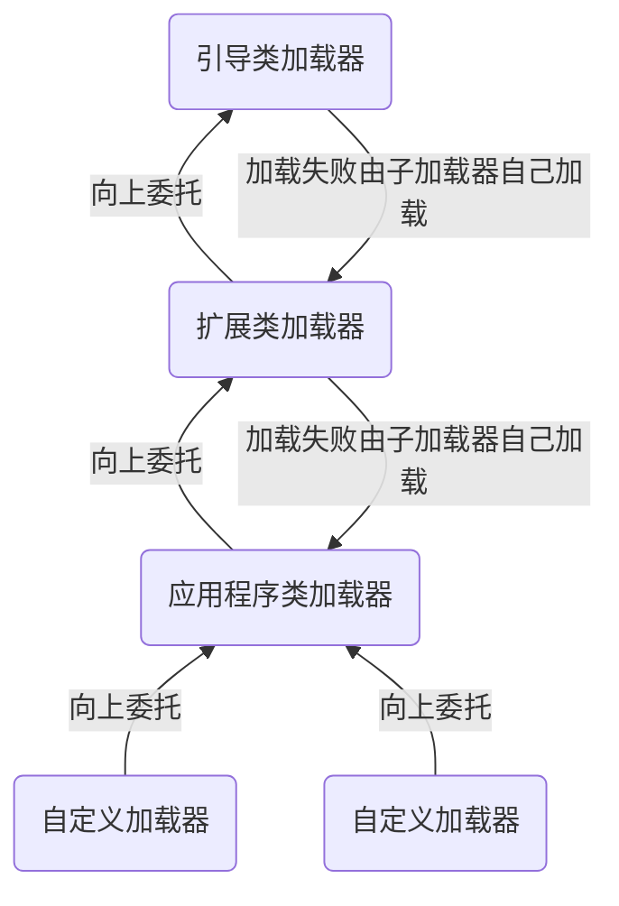

# JVM调优
## 类加载运行过程
java程序启动过程：运行某个java程序时，首先通过类加载器将将要运行的类加载到JVM中。
+ 大概流程

## 类加载初始化过程
+ 创建JVM启动器实例sun.simc.Launcher,Launcher初始话设置了单例模式，保证一个JVM虚拟机只有一个Launcher实例。
+ Launcher构造器内部创建了两个类加载器，分别是sun.misc.Launcher.ExtClassLoader（扩展类加载器）和sun.misc.Launcher.AppClassLoader(应用类加载器)
+ JVM默认使用的Launcher.getClassLoader()方法返回的是AppClassLoader的类加载器加载编写的用用程序
```java
public class Launcher{
    private static Launcher launcher = new Launcher();
    private ClassLoader loader;

    public static Launcher getLauncher(){
        return launcher;
    }
    public Launcher(){
        Launcher.ExtClassLoader var1;
        try{
            var1 = Launcher.ExtClassLoader.getExtClassLoader();
        }catch(Exception var10){
            throw new InternalError("Could not create extension class loader", var10);
        }

        //Launcher的loader属性值是AppClassLoader,一般用这个类加载器来加载我们自己写的程序。
        try{
            this.loader = Launcher.AppClassLoader.getAppClassLoader(var1);
        }catch(Exception var9){
            throw new InternalError("Could not create application class loader", var9);
        }
    
}
```
### classLoader.loadClass类加载过程步骤
+ 加载：在硬盘上查找并通过IO读入字节码文件，加载时在内存中生成一个代表该类的java.lang.Class的对象作为方法区这个类的各种数据的访问入口。（使用类时才会被加载，例如调用mian方法或者new对象的时候）。
+ 验证：检验字节码文件的正确性
+ 准备：给类的静态变量分配内存，并赋予默认值
+ 解析：将符号引用替换为直接引用，该阶段会把一些静态方法（符号引用，比如main方法）替换为直接指向数据所存的内存指针或句柄等，这是所谓的静态链接过程（类加载期间完成），动态链接指程序运行期间将符号引用替换为直接引用。
+ 初始化：对类的静态变量初始化为指定的值，执行静态代码块。

## 类加载器和双亲委派机制
### 类加载器种类
+ 引导类加载器：负载加载运行支撑JVM运行的位于JRE/lib目录下的核心类库，比如rt.jar,charset.jar等。
+ 扩展类加载器(ExtClassLoader)：负责加载运行支撑JVM运行的位于JRE/lib目录下ext扩展目录中的jar类包。
+ 应用程序类加载器(AppClassLoader)：负责加载classPaht路径下的类包，主要是自己编写的类。
+ 自定义加载器：负责加载用户自定义路径下的类包。
  

类加载就有一个**双亲委派机制**:加载某个类时会先委托父加载器寻找目标类，找不到再 委托上层父加载器加载，如果所有父加载器在自己的加载类路径下都找不到目标类，则在自己的 类加载路径中查找并载入目标类。**简单来说就是先委托父加载类进行加载，若父加载类加载过，直接返回，未加载过继续请求父加载类的父加载器加载，都为加载则由子加载器加载**

### 类加载ClassLoader源码分析
应用程序类加载器AppClassLoader源码中没有声明loadClass()方法，加载类的时候会调用父类ClassLoader的loadClass()方法，大体逻辑：
1. 首先，检查类名是否已经加载过，如果加载过了，就不用在加载，直接返回。
2. 如果此类没有加载过再判断一下是否有父加载器，如果有父加载器则由父加载器加载或调用bootStrap类加载器加载。
3. 如果父加载器及bootstrap类加载器都没有找到指定的类，那么调用当前类加载器的findClass方法来完成类加载。
```java
public class ClassLoader{
    private final classLoader parent;

    //实现双亲委派机制
    protected Class<?> loadClass(String name,boolean resolve){
        synchronized (getClassLoadingLock(name)) {
            // 检查当前类加载器是否已经加载了该类
            Class<?> c = findLoadedClass(name);
            if(c == null){
                long t0 = System.nanoTime();
                try{
                    if(parent != null){
                        //如果当前加载器父加载器不为空则委托父加载器加载该类
                        c = parent.loadClass(name,false);
                    }else{
                        //如果当前加载器父加载器为空则委托引导类加载器加载该类
                        c = findBootstrapClassOrNull(name)
                    }
                } catch (ClassNotFoundException e) {
                }

                if (c == null) {
                    long t1 = System.nanoTime();
                    //都会调用URLClassLoader的findClass方法在加载器的类路径里查找并加载该类
                    c = findClass(name);
                    sun.misc.PerfCounter.getParentDelegationTime().addTime(t1 - t0);
                    sun.misc.PerfCounter.getFindClassTime().addElapsedTimeFrom(t1);
                    sun.misc.PerfCounter.getFindClasses().increment();
                }
            }
        }
    }

    protected Class<?> findClass(String name) throws ClassNotFoundException {
        throw new ClassNotFoundException(name);
    }
}
```
-------
**思考🤔**
类加载使用双亲委派机制原因
1. 沙箱安全机制：防止核心API类库被随意篡改，例如：JVM无法加载用户自己编写的java.lang下的String类。
2. 避免类的重复加载：当父加载类已经加载了该类时，就没必要子加载类再加载一遍，保证被加载类的唯一性。

#### 全盘负责委托机制
当一个ClassLoader装载一个类时，除非显式的使用另外一个ClassLoader,该类所依赖及其引用的类也由这个ClassLoader载入。

